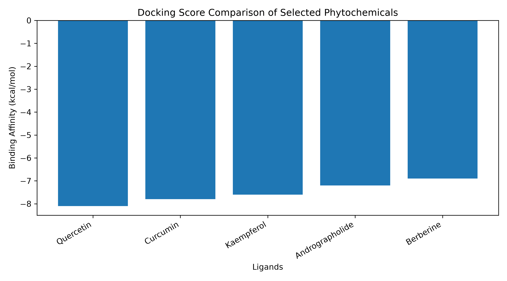

# COVID-19 Mpro Phytochemical Docking

A computational molecular docking workflow developed to explore the virtual screening of selected plant-derived compounds against the SARS-CoV-2 main protease.

## Project Overview

SARS-CoV-2 main protease (Mpro) is an important viral enzyme involved in polyprotein processing and viral replication. Due to its essential role in the viral life cycle, it has been widely investigated as a potential target in computational drug discovery and virtual screening studies.

This project presents a structured molecular docking workflow for selected phytochemicals against SARS-CoV-2 Mpro using publicly available structural biology resources and docking-based analysis.

## Aim

To evaluate selected plant-derived compounds against SARS-CoV-2 main protease using a computational molecular docking workflow.

## Objectives

- Identify SARS-CoV-2 main protease as a target protein.
- Select plant-derived compounds reported in biomedical literature.
- Organize ligand and docking result datasets.
- Rank ligands based on predicted binding affinity.
- Summarize the virtual screening results in a reproducible format.

## Repository Structure

```text
covid-mpro-phytochemical-docking/

README.md
main.py
LICENSE
.gitignore
requirements.txt

data/
    ligands.csv
    docking_results.csv

protocol/
    project_workflow.md

results/
    top_candidates.csv
    binding_affinity_plot.png

src/
    docking_analysis.py
    plot_results.py
```

## Selected Target

- Target Protein: SARS-CoV-2 Main Protease
- PDB ID: 6LU7
- Database: RCSB Protein Data Bank

## Selected Ligands

- Quercetin
- Curcumin
- Kaempferol
- Andrographolide
- Berberine

## Workflow Summary

```text
Literature Review
        ↓
Target Protein Selection
        ↓
Ligand Selection
        ↓
Structure Preparation
        ↓
Virtual Screening
        ↓
Binding Affinity Ranking
        ↓
Result Interpretation
```

## Results

The repository includes a ranked ligand dataset generated from predicted docking affinity values against SARS-CoV-2 main protease.

### Ranked Ligands

| Rank | Ligand | Binding Affinity (kcal/mol) |
|------|---------|----------------------------|
| 1 | Quercetin | -8.1 |
| 2 | Curcumin | -7.8 |
| 3 | Kaempferol | -7.6 |
| 4 | Andrographolide | -7.2 |
| 5 | Berberine | -6.9 |

Lower docking scores indicate stronger predicted binding affinity in this simplified virtual screening workflow.

### Binding Affinity Visualization

The figure below compares the predicted docking scores of selected phytochemicals against SARS-CoV-2 main protease.



The visualization highlights Quercetin as the highest-ranked ligand among the compounds included in this demonstration workflow.

## Technologies and Tools

- Python 3
- CSV Data Handling
- Object-Oriented Programming
- AutoDock Vina
- AutoDockTools
- PubChem
- RCSB Protein Data Bank
- PyMOL
- Discovery Studio Visualizer

## Requirements

Install dependencies using:

```bash
pip install -r requirements.txt
```

Current dependency:

```text
matplotlib
```

## Scientific Note

Molecular docking is a computational screening technique used to estimate potential interactions between ligands and target proteins.

Docking scores are preliminary computational predictions and should not be interpreted as evidence of biological activity, therapeutic efficacy, or clinical utility.

Any compound identified through computational docking requires further experimental validation, pharmacological evaluation, and clinical investigation.

## Future Development

Planned extensions include:

- Molecular interaction visualization and binding pose analysis
- Integration of real AutoDock Vina output files
- Protein-ligand interaction summaries
- Binding residue analysis
- Visualization of docking score distributions
- Addition of docking pose files
- Automated report generation
- ADMET property screening
- Comparative virtual screening workflows

## Author

**Ishitta Sarkar**

B.Tech Biotechnology

### Areas of Interest

- Bioinformatics
- Computational Biology
- Molecular Docking
- Computational Drug Discovery
- Precision Medicine
- Biomedical Data Science
